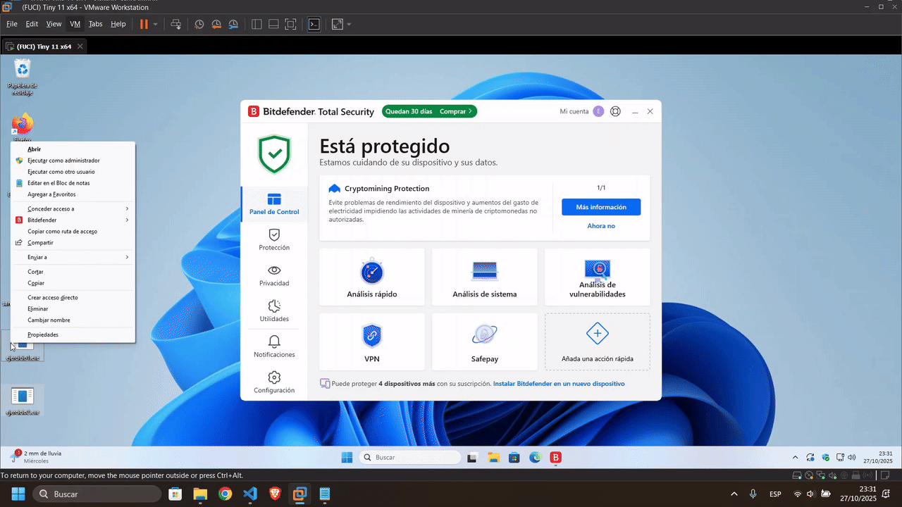
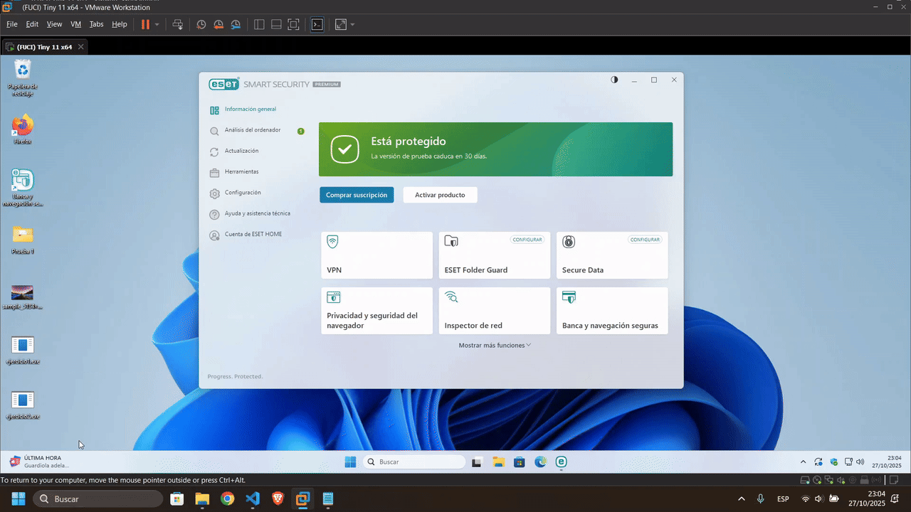

# Go-Ransomware and Vaccine
> [!CAUTION]
> For security reasons, some parts of the original code have been replaced with placeholders.

> [!NOTE]
> Para leer este documento en español, visita este [archivo](README_es.md)

A comprehensive, two-part project developed in Go to study modern encryption techniques, defense evasion, Command and Control (C2) communication, and recovery mechanisms.

## Project Architecture

The system is organized into two independent modules that operate complementarily:

```text
go-ransomware/
├── ransomware/              # Encryption Module (Redacted)
│   ├── main.go             # Entry point
│   ├── config/             # Centralized configuration
│   ├── core/               # AES-GCM Encryption engine (Redacted)
│   └── utils/
│       ├── infostealer.go  # System information gathering (Redacted)
│       ├── obfuscation.go  # Command obfuscation techniques
│       ├── persistence.go  # Persistence mechanisms (Redacted)
│       ├── reverse.go      # Reverse shell for C2 (Redacted)
│       └── shadowcopy.go   # Volume Shadow Copy manipulation (Redacted)
│
└── vaccine/                 # Recovery Module
    ├── main.go             # Vaccine entry point
    ├── config/             # Decryption configuration
    └── core/               # AES-GCM Decryption engine
```

## Features and Technical Concepts

- **Advanced Encryption (Redacted):** Implementation of AES-GCM (Galois/Counter Mode) for authenticated encryption.
- **Defense Evasion & Obfuscation:** Techniques to bypass modern endpoint protection, including dynamic string obfuscation and hidden window execution.
- **C2 Communication (Redacted):** Persistent reverse shell integration for remote command execution and key exchange.
- **System Manipulation (Redacted):** Information stealing, persistence establishment via registry, and backup destruction (VSS/WMIC).
- **Automated Compilation:** PowerShell build scripts with UPX compression and stripping for minimal footprint.

## Antivirus Evasion Demonstrations

The payloads were successfully tested against leading AV solutions (before being redacted for this public release).





## Compilation and Usage

The project includes a PowerShell script to automate the build process across both modules:

```powershell
.\build.ps1 [mode]
```

### Build Modes

**Mode 1 - Debug**: Basic compilation with full debug symbols.
```powershell
.\build.ps1 1
```

**Mode 2 - Production** (Default): Optimized build featuring:
- Removal of debug symbols (`-ldflags="-s -w"`)
- Path trimming (`-trimpath`)
- Hidden window execution (`-H windowsgui`)
- UPX Compression with LZMA (if installed)

```powershell
.\build.ps1 2
# Or simply
.\build.ps1
```

To install UPX on Windows:
```powershell
winget install upx.upx
```

## Technical Documentation

For specific information regarding each module:
- **Ransomware**: Consult `ransomware/README.md` for technical details on the encryption engine, persistence, and C2 communication.
- **Vaccine**: Consult `vaccine/README.md` for specifications regarding the recovery process.
